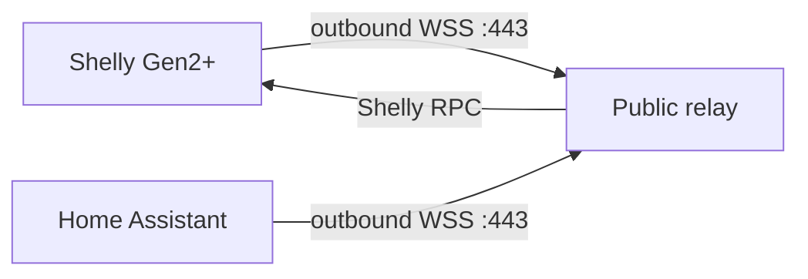

# Shelly RPC Bridge

Connect Shelly Gen2+ devices to Home Assistant across the internet without a
shared LAN, VPN, public IP address at the device site, or port forwarding.

Shelly RPC Bridge is an independent community project maintained under the
pseudonym **Dr House**. It isn't affiliated with or endorsed by Shelly Group or
Home Assistant.

> **Status:** `0.1.0` is an MVP. The relay protocol is covered by automated
> end-to-end tests. Validate the integration with real hardware before using it
> for critical loads.

## How it works



Both sides create outbound encrypted WebSocket connections. A device token
assigns Shelly devices to a site. A separate HA token gives one or more Home
Assistant installations access to that site.

## Supported in the first release

- Shelly Gen2+, Pro, Gen3 and Gen4 RPC devices.
- Multiple Shelly devices per Home Assistant site.
- Multiple independent HA sites on one relay.
- Push status updates and remote RPC commands.
- Switch and Shelly CB control.
- Light, RGB and RGBW control.
- Cover control.
- Automatic numeric sensors, including PM/EM voltage, current, power and energy.
- Automatic boolean/binary sensors.
- Sleeping/battery devices keep their last relay snapshot.

Shelly Gen1 doesn't provide the Gen2 RPC outbound WebSocket channel and isn't
supported. It will require a separate MQTT transport in a later release.

## 1. Run the public relay

Requirements:

- A small Linux VPS with Docker and Docker Compose.
- A domain or subdomain pointing to the VPS.
- Inbound TCP ports 80 and 443 open on the VPS.

Copy the example environment file and generate two different secrets:

```bash
cp .env.example .env
python3 -c 'import secrets; print(secrets.token_urlsafe(32))'
python3 -c 'import secrets; print(secrets.token_urlsafe(32))'
```

Edit `.env`:

```dotenv
BRIDGE_DOMAIN=relay.example.com
BRIDGE_SITE_ID=home
BRIDGE_DEVICE_TOKEN=first-generated-secret
BRIDGE_HA_TOKEN=second-generated-secret
BRIDGE_ALLOW_DANGEROUS_RPC=false
```

Start the service:

```bash
docker compose up -d --build
docker compose ps
docker compose logs --tail=100 relay caddy
```

Caddy obtains and renews the TLS certificate automatically. No certificate is
stored on a Shelly device.

## 2. Configure every Shelly

Open the local Shelly web interface:

1. Go to **Settings → Networks → Outbound websocket**.
2. Enable the connection.
3. Select **Default TLS**.
4. Enter:

```text
wss://relay.example.com/device?token=BRIDGE_DEVICE_TOKEN
```

5. Save and confirm that the WebSocket status becomes connected.

Use the same device URL for every Shelly that should appear in this HA site.
Move a device to another HA site by replacing its device token.

## 3. Install in Home Assistant

### HACS custom repository

After this project is published on GitHub:

1. Open **HACS → Integrations**.
2. Open the menu and select **Custom repositories**.
3. Add the GitHub repository URL with category **Integration**.
4. Download **Shelly RPC Bridge** and restart Home Assistant.

### Manual installation

Copy this directory into the HA configuration folder:

```text
custom_components/shelly_rpc_bridge
```

Restart Home Assistant, then open:

**Settings → Devices & services → Add integration → Shelly RPC Bridge**

Enter:

```text
Relay URL: wss://relay.example.com/ha
Home Assistant token: BRIDGE_HA_TOKEN
```

Do not enter `BRIDGE_DEVICE_TOKEN` in Home Assistant.

## Multiple independent HA sites

For more than one site, set `BRIDGE_SITES_JSON` instead of the three single-site
variables:

```dotenv
BRIDGE_SITES_JSON={"house-a":{"device_token":"32-or-more-characters-a","ha_token":"32-or-more-characters-b"},"house-b":{"device_token":"32-or-more-characters-c","ha_token":"32-or-more-characters-d"}}
```

Each site's Shelly devices use its `device_token`; its HA integration uses the
matching `ha_token`.

## Security model

- TLS/WSS is terminated by Caddy on port 443.
- Device and HA credentials are separate and compared in constant time.
- No default credentials exist; tokens shorter than 32 characters are rejected.
- Messages are limited to 1 MiB.
- Factory reset, firmware update, network reconfiguration, scripts, schedules
  and webhooks are blocked at the relay by default.
- Keep `.env` private and never commit it.

The token is part of the Shelly WebSocket URL because the device UI doesn't
provide a custom Authorization header. Avoid enabling proxy access logs that
record full query strings. Rotate a token if a screenshot or log exposes it.

## Development and tests

```bash
python3 -m pip install -r relay/requirements.txt
python3 -m unittest discover -s tests -v
python3 -m compileall -q custom_components relay
```

The tests simulate both WebSocket peers and verify identification, cached
component discovery, bidirectional RPC routing, token rejection, and blocking
of destructive RPC methods.

## Publishing checklist

- Run the HACS and Hassfest GitHub Actions.
- Test one PM/EM device and one actuator on real hardware.
- Tag the first tested release, for example `v0.1.0`.

## License

[MIT](LICENSE)
